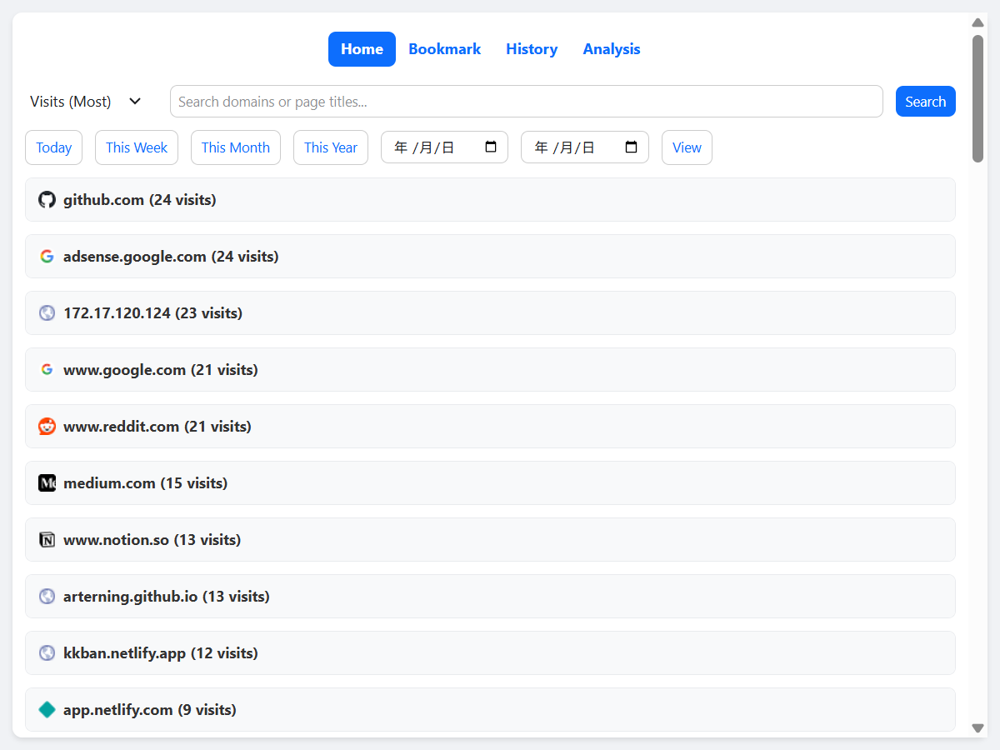
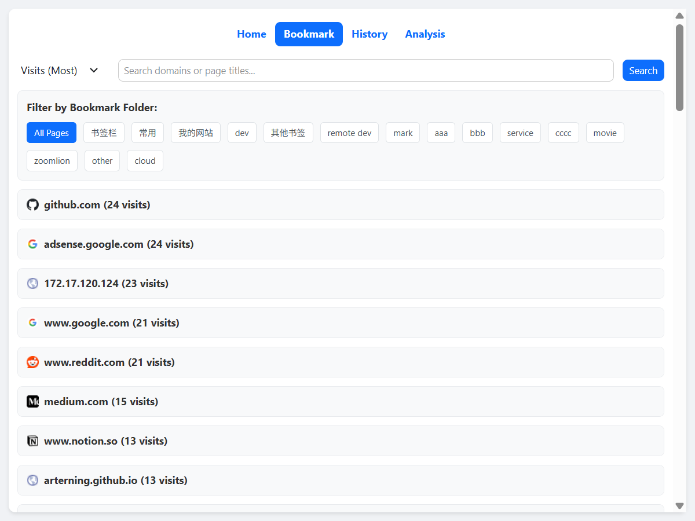

# BrowseTrack: Browser History Analyzer & Bookmark Manager  
A browser extension that helps you track, categorize, and visualize your web browsing habits—making your online experience more efficient.  


## ✨ Core Features  
### 1. Smart Browsing History Analysis  
- **Domain-Based Categorization**: Automatically identifies and aggregates your browsing history by domain (e.g., `github.com`, `stackoverflow.com`), grouping visits for easy overview.  
- **Most Visited Sites**: Generates a ranked list of your most frequently visited websites based on visit count, duration, and recency, giving clear insights into your browsing preferences.  



### 2. Intuitive Bookmark Management & Display  
- **Bookmark Visualization**: Displays your bookmarks in clean cards or lists, with support for filtering by domain or custom tags.  
- **Quick Access**: One-click navigation to your saved bookmarks, with smart recommendations for frequently used sites based on your browsing history.  



## 🚀 Use Cases  
- Want to understand your online habits and optimize time spent on websites?  
- Struggle with cluttered bookmarks and need domain-based organization?  
- Need a quick overview of your most visited sites to reduce repetitive searching?  


## 📦 Installation & Setup  
### For Chrome/Firefox  
1. Clone this repository:  
   ```bash
   git clone https://github.com/your-username/browsetrack-extension.git
   cd browsetrack-extension
   ```  

2. Load the extension in your browser:  
   - **Chrome**: Open `chrome://extensions/`, enable "Developer mode", click "Load unpacked", and select the project folder.  
   - **Firefox**: Open `about:debugging#/runtime/this-firefox`, click "Load Temporary Add-on", and select the `manifest.json` file.  


## 🛠️ Basic Usage  
1. On first launch, grant the extension permission to access your browsing history and bookmarks (required for analysis).  
2. Navigate to the "Analytics" tab to view domain-based history categories and your most visited sites.  
3. Switch to the "Bookmarks" tab to browse, filter, or quickly jump to your saved links.  


## 🔒 Privacy Note  
All data (browsing history, bookmarks) is processed locally in your browser. No information is stored or shared externally.  


## 🤝 Contributing  
Feel free to submit issues or pull requests to improve features, fix bugs, or add support for more browsers!  
