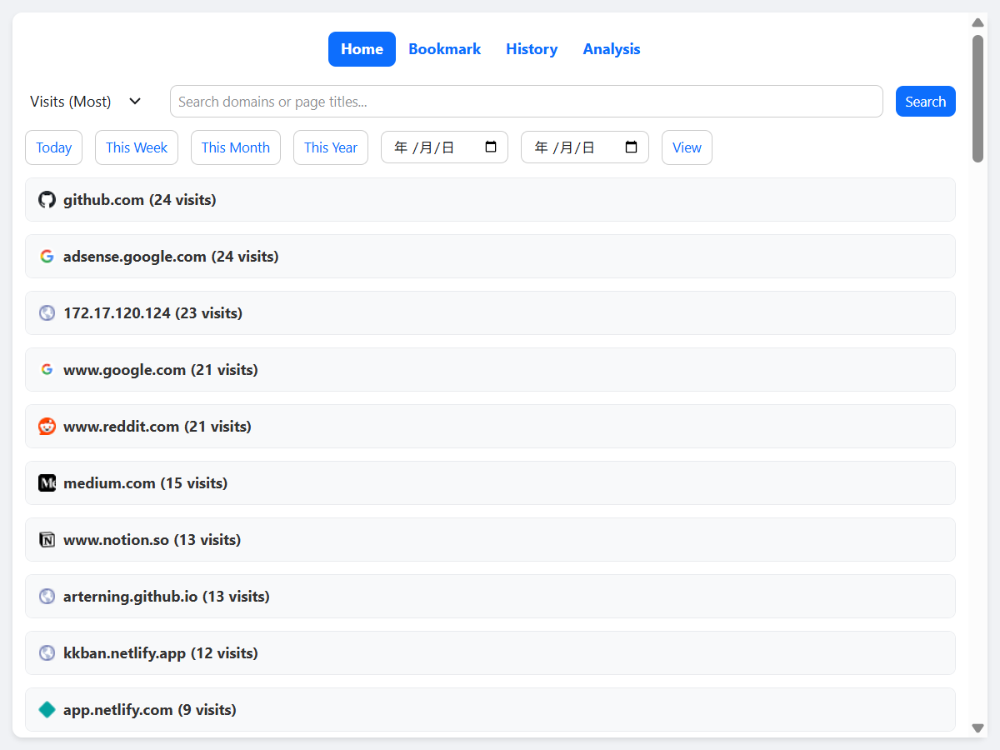
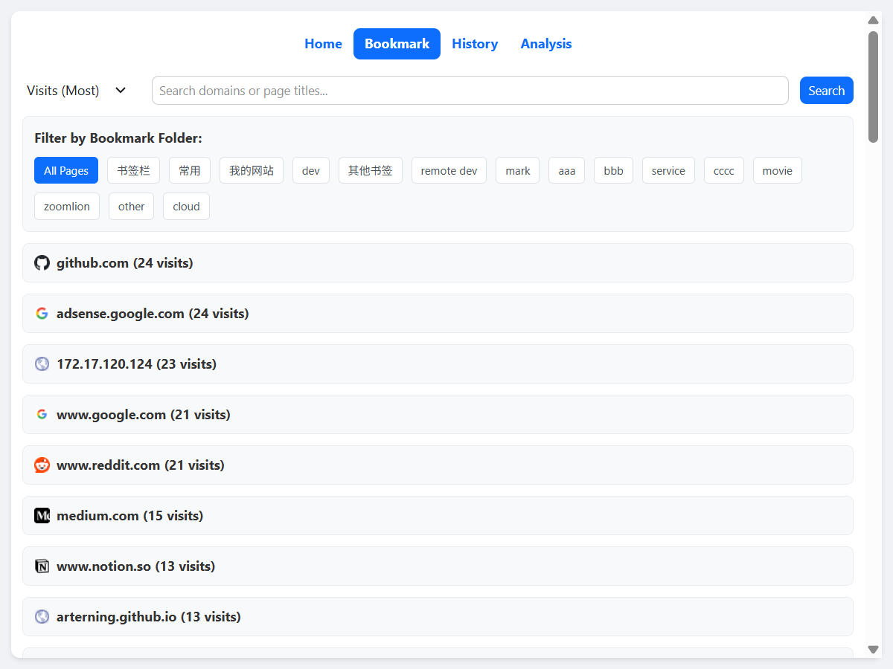

# BrowseTrack：浏览器浏览记录分析与书签管理插件  
一款帮你追踪、分类和可视化网页浏览习惯的浏览器插件，让上网体验更高效。  


## ✨ 核心功能  
### 1. 智能浏览记录分析  
- **按域名自动分类**：自动识别并汇总浏览记录，按域名（如 `github.com`、`stackoverflow.com`）分组展示，清晰呈现各网站的访问情况。  
- **常用网站排行**：基于访问次数、时长和近期活跃度，生成“最常访问网站”排行榜，直观反映你的浏览偏好。  




### 2. 直观书签管理与展示  
- **书签可视化展示**：以简洁的卡片或列表形式展示书签，支持按域名或自定义标签筛选。  
- **一键快速访问**：直接跳转至已保存的书签，并根据你的浏览记录智能推荐高频使用的网站。  



## 🚀 适用场景  
- 想了解自己的上网习惯，优化网站使用时间？  
- 书签太多杂乱无章，需要按域名分类整理？  
- 希望快速查看高频访问网站，减少重复搜索时间？  


## 📦 安装与配置  
### 适用于 Chrome / Firefox 浏览器  
1. 克隆本仓库：  
   ```bash
   git clone https://github.com/你的用户名/browsetrack-extension.git
   cd browsetrack-extension
   ```  

2. 在浏览器中加载插件：  
   - **Chrome**：打开 `chrome://extensions/`，启用“开发者模式”，点击“加载已解压的扩展程序”，选择项目文件夹。  
   - **Firefox**：打开 `about:debugging#/runtime/this-firefox`，点击“临时载入附加组件”，选择项目中的 `manifest.json` 文件。  


## 🛠️ 基本使用  
1. 首次启动时，授予插件访问浏览记录和书签的权限（分析功能必需）。  
2. 进入“分析”标签页，查看按域名分类的历史记录和最常访问网站。  
3. 切换到“书签”标签页，可浏览、筛选或快速跳转至已保存的链接。  


## 🔒 隐私说明  
所有数据（浏览记录、书签）均在浏览器本地处理，不会存储或向外部分享任何信息。  


## 🤝 贡献指南  
欢迎提交 issue 或 pull request 来优化功能、修复漏洞，或扩展对更多浏览器的支持！  
